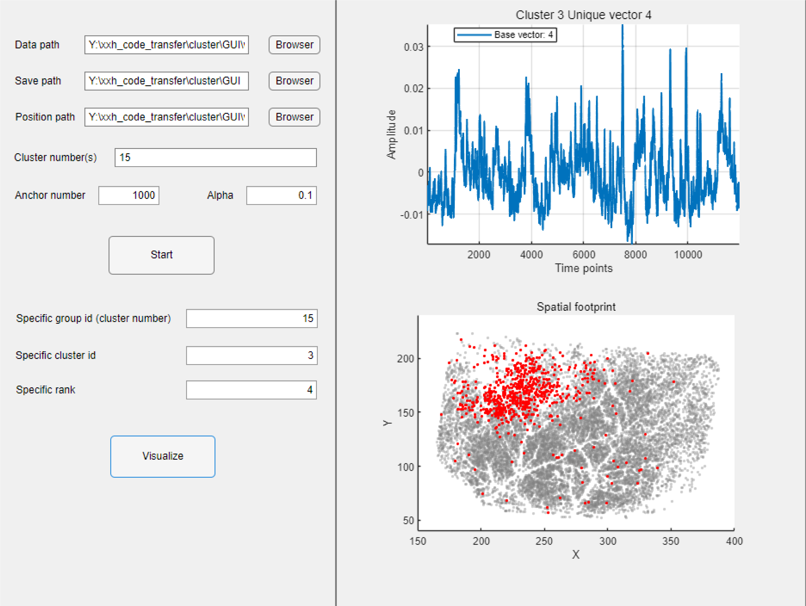

### Introduction and requirements of the GUI:
1, The neural data mat file should contain a term named 'whole_trace_ori' consisting of a NxT matrix standing for neural signal, where N represents the neural number and T represents the time pionts. We provide the normalization step inside the GUI.

2, If you can provide the neural position, this file should contain a term named 'whole_center_2d_T' consisting of a Nx2 matrix standing for neural coordinates for all the neurons.

3, The 'Anchor number' represents the number of anchors used for the K-means clustering at the very beginning for anchor selection; 'Alpha' represents the penalty coefficient.

4, The 'Specific cluster id' should not be more than the corresponding cluster number.

5, We only provide the top 10 ranks of the unique bases so the 'specific rank' cannot exceed 10.

6, The top right panel will show the extracted unique basiss. The bottom right panel will show the spatial distribution of the clusters based on the neural position and the cluster result.

  

